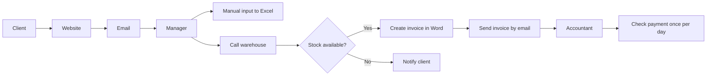

```mermaid
flowchart LR
    Client[Client] --> Site[Website]
    Site --> Email[Email]
    Email --> Manager[Manager]

    Manager --> Excel[Manual input to Excel]
    Manager --> Call[Call warehouse]

    Call --> Stock{Stock available?}

    Stock -->|Yes| Invoice[Create invoice in Word]
    Stock -->|No| Notify[Notify client]

    Invoice --> Send[Send invoice by email]
    Send --> Accountant[Accountant]
    Accountant --> Check[Check payment once per day]
```
