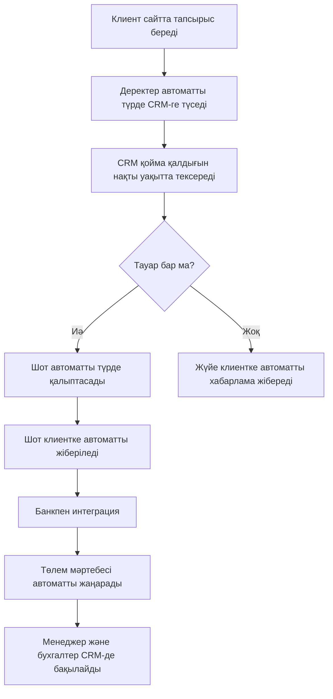

```mermaid
flowchart TD
    A[Клиент сайтта тапсырыс береді] --> B[Деректер автоматты түрде CRM-ге түседі]
    B --> C[CRM қойма қалдығын нақты уақытта тексереді]
    C --> D{Тауар бар ма?}
    D -- Иә --> E[Шот автоматты түрде қалыптасады]
    E --> F[Шот клиентке автоматты жіберіледі]
    F --> G[Банкпен интеграция]
    G --> H[Төлем мәртебесі автоматты жаңарады]
    H --> I[Менеджер және бухгалтер CRM-де бақылайды]
    D -- Жоқ --> J[Жүйе клиентке автоматты хабарлама жібереді]
```
