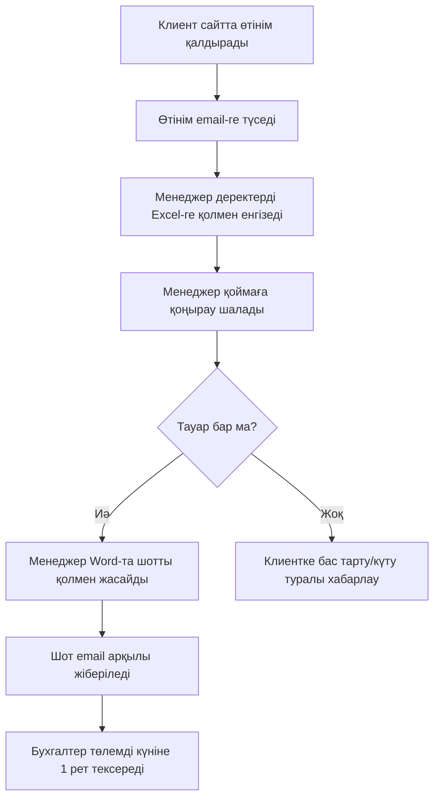

```mermaid
flowchart TD
    A[Клиент сайтта өтінім қалдырады] --> B[Өтінім email-ге түседі]
    B --> C[Менеджер деректерді Excel-ге қолмен енгізеді]
    C --> D[Менеджер қоймаға қоңырау шалады]
    D --> E{Тауар бар ма?}
    E -- Иә --> F[Менеджер Word-та шотты қолмен жасайды]
    E -- Жоқ --> G[Клиентке бас тарту/күту туралы хабарлау]
    F --> H[Шот email арқылы жіберіледі]
    H --> I[Бухгалтер төлемді күніне 1 рет тексереді]
```
